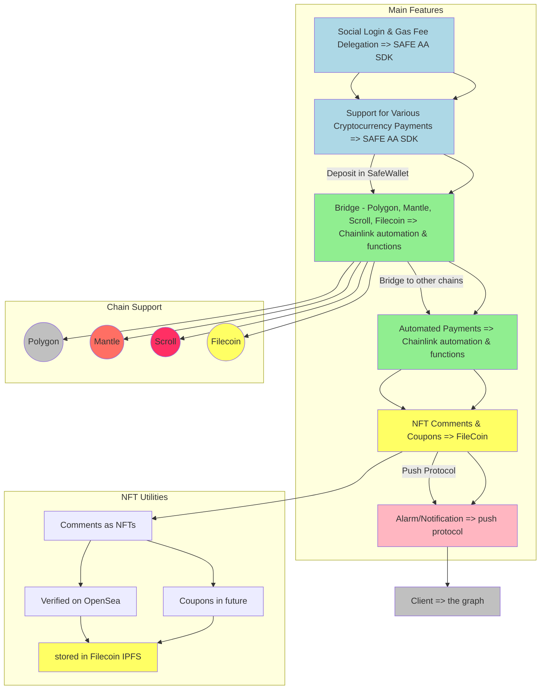

# eAAts Delivery Platform

eAAts maintains the user experience of traditional delivery platforms while utilizing blockchain technology to reduce delivery costs and support a variety of cryptocurrency payments, providing an innovative service.

## Core Features

### 1. Social Login & Gas Fee Delegation

- Utilizes Safe AA SDK’s `Auth` feature to offer easy login through social network accounts.
- `Protocol`, `Onramp`, and `Relay` features allow users to receive gas fee delegation, so they won't feel the burden of transaction costs.

### 2. Support for Various Cryptocurrency Payments

- Users can deposit cryptocurrencies into their `SafeWallet` and make payments with various cryptocurrencies.

### 3. Bridge

- The application is based on the Polygon mainnet and implements bridges to utilize assets from Mantle, Scroll, and Filecoin chains.

### 4. Automated Payments

- `AbstractedWallet` is deployed on Mantle, Scroll, and Filecoin chains. Each user has their own `AbstractedWallet` to facilitate automated payments.
- Leverages Chainlink’s `Automation` feature to detect order completion events and utilize the `Functions` feature to proceed with automated payments via contracts on the Polygon chain.

### 5. NFT Comments & Coupons

- Users can leave comments after payment, which will be converted into NFTs.
- These NFTs can be verified on OpenSea and may be used as coupons in the future.

## Flow Chart
- Tool : SAFE, Chainlink, Filecoin(IPFS- nftStorage & web3.stroage), PushProtocol, theGraph
- Network : Polygon, Mantle, Scroll, Filecoin

